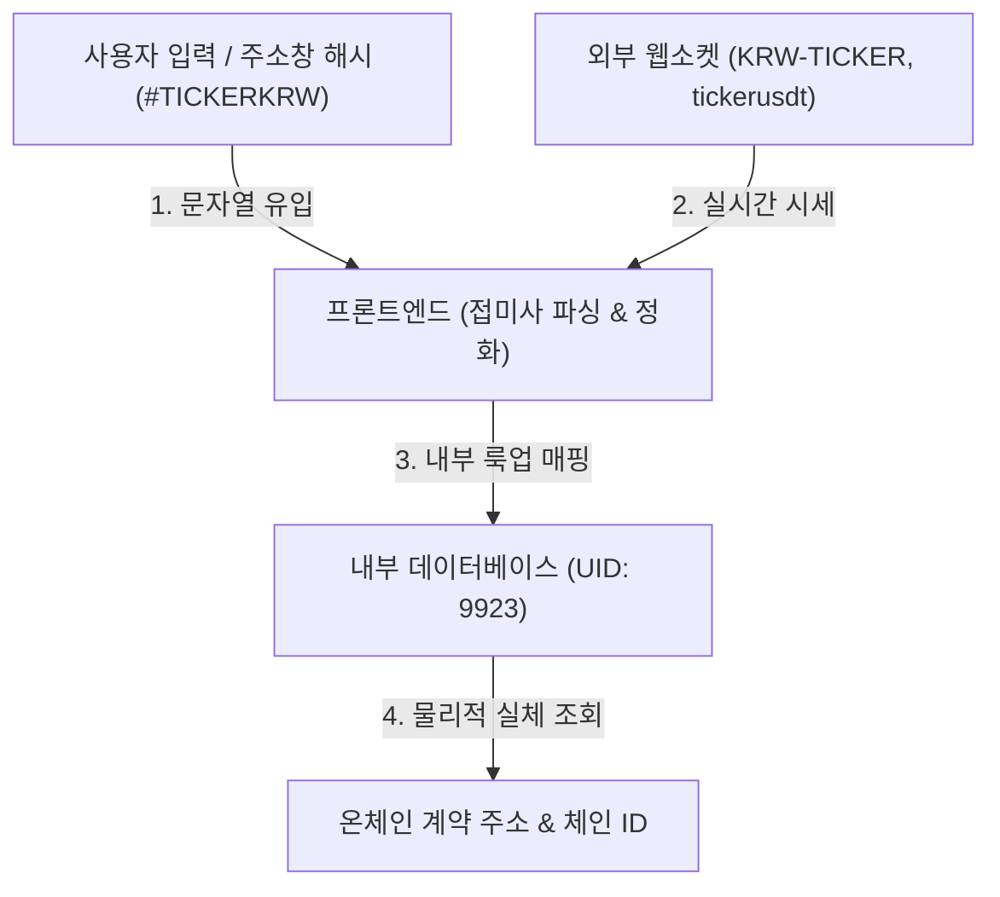

---


---

# 통합 트레이딩 터미널의 자산 식별자(Asset Identity) 설계 및 철학 백서

본 문서는 멀티거래소 통합 암호화폐 터미널(Sellnance) 설계에 있어서, 고유 식별자(`UID`), 거래소별 티커(Ticker/Symbol), 그리고 온체인 계약 주소(Contract Address) 간의 다단계 변환 및 분기 처리가 필요한 구조적 당위성과 자산 정체성(Asset Identity)의 본질에 대해 정리합니다.

---

## 1. 개요: 왜 지저분한 문자열 분기 로직이 필요한가?

시스템 내부적으로 고유 식별자(`UID`)라는 100% 정합도를 가진 기준점이 존재함에도 불구하고, 프론트엔드 코드(예: `_store.js`, `chart_data.js`, `ui_control.js`)에서 문자열 접미사(`KRW`, `USDT`)를 떼어내고 복잡한 분기 비교를 수행해야 하는 핵심 원인은 **프론트엔드가 외부 시스템과 상호작용하는 경계선(Boundary)**에 서 있기 때문입니다.



### 문자열 파싱 분기가 필수적인 3대 제약 요인

1. **인간 친화적 진입점 (URL Hash & 검색창)**
   * 사용자는 주소창에 `http://127.0.0.1:8000/#9923`과 같은 숫자 UID를 치고 들어오지 않습니다. 직관적으로 `#TICKERKRW` 또는 `#TICKERUSDT`를 입력하고 북마크합니다.
   * 사용자가 마주하는 최전선 인터페이스가 **문자열 티커** 기반이므로, 시스템은 이를 파싱하여 내부 UID와 매칭하는 역파싱(Reverse Parsing)을 수행해야 합니다.

2. **외부 거래소 API 및 웹소켓의 한계**
   * 업비트, 바이낸스, 바이비트 등의 실시간 시세 웹소켓은 플랫폼 내부의 `UID`를 알지 못하며, 오직 `KRW-TAIKO`나 `taikousdt` 같은 문자열로만 패킷을 전송합니다.
   * 실시간 시세가 유입되는 순간(`stream.js`), 프론트엔드는 들어온 문자열을 기반으로 기존 메모리 테이블의 행을 매칭해야 하므로 정교한 예외 처리가 동반됩니다.

3. **초기 로딩 시점의 레이스 컨디션 (Race Condition)**
   * 백엔드로부터 전체 매핑 테이블을 비동기로 로드하기 전에, 브라우저가 주소창의 해시만을 보고 차트 레이아웃을 그리고 외부 거래소에 과거 데이터를 요청해야 하는 찰나의 공백이 존재합니다. 이때 날것의 문자열 가공 분기가 필수 방어막 역할을 합니다.

---

## 2. 관련 소프트웨어 설계 및 데이터 용어 정리

| 용어 | 정의 | 본 시스템에서의 적용 |
| :--- | :--- | :--- |
| **부패 방지 계층**<br>*(Anti-Corruption Layer, ACL)* | 외부 시스템의 비정형 데이터가 내부 시스템의 깨끗한 도메인 영역을 오염시키지 않도록 경계선에서 번역/정제해주는 완충 계층 | 소켓 시세, 해시 값에서 접미사를 필터링하고 내부 `UID` 데이터와 조화시키는 `selectSymbol`, `getPrecision` 내 가공 로직 |
| **캐노니컬라이제이션**<br>*(Canonicalization / 정형화)* | 표현 방식이 여러 개인 데이터들을 가장 표준적이고 규일한 단 하나의 형태(Canonical Form)로 통일하는 과정 | `TICKERKRW`, `TICKERUSDT`, `KRW-TICKER`를 `TICKER` 혹은 고유 `UID`로 단일화하는 연산 |
| **데이터 정화**<br>*(Data Cleansing / Sanitization)* | 입력값 또는 외부 데이터 스트림에서 노이즈(예: 접미사, 특수문자 등)를 깎아내고 표준 형태로 다듬는 행위 | `endsWith("KRW")` 등을 판별하여 순수 기호만 슬라이싱해 내는 정제 작업 |
| **어댑터 패턴**<br>*(Adapter Pattern)* | 서로 다른 두 인터페이스 간의 규격을 맞추기 위해 중간에서 호환 가능하도록 변환해주는 디자인 패턴 | 외부 거래소 Ticker 인터페이스와 내부 데이터베이스의 UID 규격을 중재하는 처리 흐름 |

---

## 3. 거래소별 티커 상이성 및 자산 중복·충돌 문제 (Ticker Discrepancy & Collision)

외부 거래소마다 독자적인 명명 규칙을 사용하거나 자산의 변형을 처리하는 방식이 다르기 때문에 발생하는 자산 중복, 겹침, 충돌 문제는 단일 기준점(`UID`) 없이 문자열 티커만 사용했을 때 터미널 시스템이 겪게 되는 가장 큰 위협입니다.

1. **동일 자산에 대한 서로 다른 티커명 (Ticker Discrepancy)**
   * **사례**: 동일한 리브랜딩/스왑 자산에 대해 어떤 거래소는 `BTT`로 유지하고, 다른 거래소는 `BTTC`로 명명합니다. (테라 루나 사태 때의 `LUNA`와 `LUNC`도 유사합니다.)
   * **사례**: 바이낸스 선물은 레버리지 거래 단위를 맞추기 위해 `1000SHIB` 또는 `1000PEPE`라는 인덱스 티커를 쓰지만, 업비트는 현물의 `SHIB`나 `PEPE` 기호를 그대로 씁니다.
   * **결과**: 만약 이들을 단순 텍스트 매핑으로 처리한다면, 플랫폼은 두 자산이 사실상 동일한 자산(또는 1000배율의 동일 기초자산)이라는 사실을 인지하지 못하고 별개의 자산으로 나누어 표시하게 되어 실시간 김프 연산 및 호가 통합 분석이 깨집니다.

2. **서로 다른 자산에 대한 동일한 티커명 (Ticker Collision / 동명이인 코인)**
   * **사례**: 완전히 서로 다른 체인에서 발행된 독립적인 프로젝트가 우연히 동일한 기호(예: `GAS` - 네오 가스 vs 타 거래소의 독립 가스 토큰, 혹은 서로 다른 레이어에 존재하는 동명의 `META` 토큰)를 사용하는 경우입니다.
   * **결과**: 이들을 `UID` 구분 없이 단지 `"GAS"`라는 문자열 키로만 매핑한다면, 시스템 내부에서 두 자산의 장부가 하나로 병합되어 가격 데이터 오염, 볼륨 왜곡, 그리고 최종적으로 엉뚱한 코인의 차트가 렌더링되는 치명적인 크래시(Overlap)가 발생합니다.

3. **거래소 고유의 통화 쌍(Pair) 접미사**
   * **사례**: 원화 마켓의 `BTC/KRW` (Upbit: `KRW-BTC`, Bithumb: `BTC_KRW`), 테더 마켓의 `BTC/USDT` 등 거래소마다 통화 쌍을 붙이는 포맷이 다릅니다.
   * **결과**: 이러한 표기법적 파편화는 실시간으로 들어오는 소켓 데이터를 파싱할 때 `UID`로 정규화(Normalization)하지 않는 한 끊임없는 예외 처리 코드가 누적되는 주범이 됩니다.

---

## 4. 자산 식별의 궁극적 실체(Absolute Truth)에 대한 고찰

### Q1. 온체인 컨트랙트 주소는 완벽한 불변의 값인가?
**아닙니다.** 기술적으로 가장 로우레벨에 위치한 온체인 컨트랙트 주소조차 다음과 같은 취약점과 변수를 가집니다.

* **멀티체인 분기 (Multi-chain Expansion)**: 동일한 자산(예: `USDT`)이 이더리움, 솔라나, 아비트룸 등 수십 개의 체인 상에 서로 완전히 다른 컨트랙트 주소로 발행됩니다. 그러나 금융 시장에서는 이를 하나의 경제적 자산으로 통합 취급합니다.
* **하드포크의 복제성 (Hard Fork Paradox)**: 네트워크가 하드포크(예: ETH vs ETHW)되면 완전히 동일한 컨트랙트 주소와 소유권 정보가 양쪽 체인에 똑같이 복제됩니다. 암호학적으로 어떤 계약이 진짜 정통성을 지녔는지 증명할 수 없습니다.
* **담보 종속성 (Wrapped Token Risk)**: 래핑된 자산(예: `WBTC`)의 계약 주소는 원본 자산의 보관소(Vault) 안전성에 100% 종속됩니다. 보관소가 해킹당하면 컨트랙트 주소는 그대로 있어도 가치는 증발합니다.

### Q2. 진짜 가리키는 불변의 값은 존재하지 않는가?
**존재하지 않습니다 (O).** 
블록체인의 암호학적 주소와 원장도 결국 **"사회적 합의(Social Consensus)"**가 유지되는 동안에만 일시적으로 유효한 상대적 약속입니다.

* 하드포크 시 어떤 코인이 '진짜' 정통성을 차지하는가는 기술이나 코드가 아닌, **대형 거래소의 지원 여부**, **스테이블코인 발행사의 지급 보증**, 그리고 **커뮤니티와 자본의 선택**에 의해 사후적으로 합의됩니다.
* 따라서, 모든 식별 체계는 물리적 불변의 진실 위에 세워진 것이 아니라 끊임없이 유동하는 사회적/경제적 합의체를 추적하고 있을 뿐입니다.

---

## 4. 보안 위협 및 인적 취약성(Human Error)이 자산 식별성에 미치는 영향

온체인 계약 주소와 오프체인 데이터베이스(`UID` 매핑) 모두 외부의 인위적인 공격(해킹, 키 탈취)이나 사람의 인지적 취약점(휴먼 에러)에 의해 정체성의 진실이 무너지는 강력한 변수를 안고 있습니다.

1. **컨트랙트 권한 탈취 및 취약점 공격 (Contract Exploits & Hacks)**
   * 프로젝트 운영자의 멀티시그 프라이빗 키가 탈취되거나 스마트 계약 내 무한 발행(Mint) 루프 같은 치명적인 로직 버그가 발각되어 공격을 받으면 기존 코인의 경제적 실체는 즉시 소멸합니다.
   * 이때 발행사는 수습을 위해 **새로운 컨트랙트 주소(V2)**를 배포하고 자산 이관(Migration)을 수행하게 됩니다. 블록체인상에 기존 V1 주소는 여전히 활성화되어 존재하지만 정체성을 잃어버리고 껍데기만 남게 되며, 시스템 내부에서 '진짜 자산'을 식별하는 기준점도 강제로 변경해야 하는 상황이 초래됩니다.

2. **데이터베이스 및 API 하이재킹 (API & DB Hijacking)**
   * 코인마켓캡 등의 중앙화 포털 API가 해킹당하거나, Sellnance 내부 백엔드 DB가 침해되어 `UID` 매핑 장부가 조작되는 경우입니다.
   * 해커가 데이터베이스 내에서 `BTC` 티커에 대응하는 `UID`를 공격자의 악성 스캠 토큰 UID로 은밀히 바꿔치기한다면, 프론트엔드는 암호학적 정교함과 무관하게 공격자가 의도한 시세와 차트를 화면에 노출하게 됩니다.

3. **인적 기입 에러 (Human Vulnerability & Typo)**
   * 새로운 코인이 상장될 때 관리자가 수동으로 매핑 설정 파일(`mapping.json` 등)을 업데이트하는 과정에서 오타나 중복 UID를 기입하는 휴먼 에러가 발생할 수 있습니다.
   * 이는 시스템이 아무리 견고하게 동작해도 입력값 오염에 의해 식별 필터가 완전히 깨질 수 있음을 보여주는 대표적인 취약점입니다.

4. **피싱 및 유사 티커 혼동 (Phishing & Look-alike Tokens)**
   * 악의적인 공격자들이 유명 코인의 기호(예: `USDT`, `PEPE`)와 똑같은 이름의 스캠 토큰을 다른 네트워크에 무단 배포하여 사용자들의 혼란을 유도하는 사회 공학적(Social Engineering) 공격 방식입니다. 
   * 단지 "텍스트 티커가 같다"는 인간의 인지적 느슨함을 공략하는 것이며, 시스템이 주소창 해시나 검색 필터에서 온체인 주소(또는 검증된 UID)를 철저히 교차 검증하지 않으면 휴먼 에러로 이어집니다.

---

## 5. 결론 및 플랫폼의 지향점

본 트레이딩 터미널(`Sellnance`)의 식별 시스템 설계는 다음과 같은 계층적 추상화를 통해 경제적 진실을 화면에 구현합니다.

```
[물리적 현실] 온체인 계약 주소 (원장상 실체, 하드포크/해킹/마이그레이션 리스크 상존)
       ↓
[중앙화 표준] 코인마켓캡 ID (UID - 메타데이터 통합, 해킹 및 오프체인 조작 위협 방어 계층)
       ↓
[사용자 접점] 거래소 티커 및 해시 (사용자 조작 및 실시간 소켓 매핑, 인적 혼선/피싱 차단벽)
```

따라서 현재의 정밀한 접미사 파싱 로직은 백엔드의 설계적 완성도와 무관하게, 외부 공격 및 인적 취약성 요소가 실시간 정보에 미치는 영향을 최소화하고 **"금융 시장의 복잡한 실시간 원시 데이터(Raw Data)"**를 사용자가 신뢰할 수 있는 **"일관된 경제적 실체(Canonical Asset)"**로 결합해 주기 위해 프론트엔드가 반드시 감당해야 하는 핵심 엔진 계층입니다.

궁극적으로, 가상자산 식별 체계를 다룰 때는 모든 예외를 무리하게 자동화 코드로 해결하려 하기보다 **'시스템이 실시간으로 방어할 통제 가능한 기술 영역'과 '인위적인 사회적 합의 및 운영으로 대처해야 할 불가항력적 외생 변수 영역'의 경계를 설정하는 균형 잡힌 시각**이 필요합니다. 일상적인 거래소 간 규격 불일치는 로직으로 자동 정규화하되, 하드포크나 해킹 마이그레이션 같은 파괴적 경제 사건은 유연한 메타데이터 관리(운영)로 대처하는 것이 가상자산 터미널 엔지니어링의 지속 가능한 지향점입니다.

### [부록] 전통 금융(TradFi)과의 비교: 중앙화된 질서 vs 탈중앙화된 혁신의 비용

전통 주식 시장은 국제 표준 기구(ISO)가 발행하는 **ISIN(국제증권식별번호)**과 **ANNA/예탁결제원** 같은 강력한 중앙 통제 기구를 통해 전 세계 모든 금융 데이터베이스의 정합성을 100% 일관되게 통제합니다. 이는 정합성과 안정성 측면에서 코인 생태계보다 월등히 질서 정연합니다.

그러나 전통 금융의 철저한 규격화는 **"극도로 느린 속도와 높은 장벽"**이라는 대가를 치릅니다. 주식 하나를 상장하고 코드를 부여받아 전 세계 시스템에 배포하는 데는 수주에서 수개월의 행정 절차가 소요됩니다. 

반면, 가상자산 생태계는 단 3초 만에 토큰을 배포하고 유동성을 공급하여 즉시 글로벌 거래를 시작할 수 있습니다. 이 과정에서 발생하는 **식별자의 파편화와 중복, 겹침 현상은 '탈중앙화된 허가 없는 혁신(Permissionless Innovation)'을 얻기 위해 프론트엔드와 엔지니어가 기꺼이 치러야 하는 기술적 비용**입니다. 본 플랫폼의 식별 엔진은 바로 이 혁신의 비용을 기술로 극복하는 브릿지 역할을 수행합니다.


---

 ## 📝 라이선스 및 면책 조항 (License & Disclaimer)
 * **License:** MIT License. 개인 학습, 연구 및 포트폴리오 목적의 수정/배포를 환영합니다.
 * **Disclaimer:** 본 프로젝트는 실시간 데이터 분석 및 시뮬레이션을 위한 도구입니다.
 * 제공되는 시세 정보의 지연이나 오류가 발생할 수 있으며, 이를 바탕으로 한 실제 트레이딩 손실에 대해서는 어떠한 법적 책임도 지지 않습니다.
 * (거래소 API 이용 약관 준수 필수)

---
