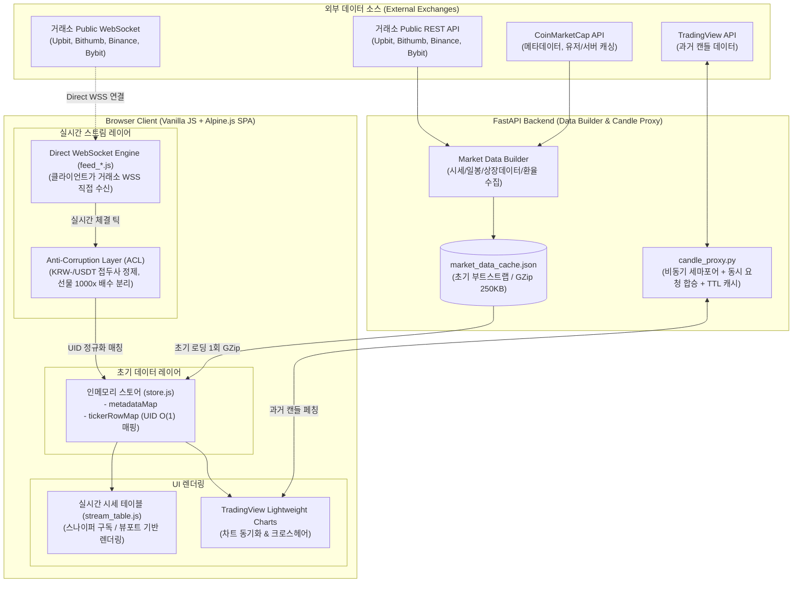

# Sellnance (셀낸스)
### 멀티 거래소 실시간 시세 & 김치프리미엄 통합 분석 터미널 (Sell + Binance)


<p align="center">
  <a href="https://sellnance.app"><strong>Live Demo: sellnance.app</strong></a>
</p>

<p align="center">
  
  
  
  
  
  
  
  
  
</p>

---

## Project Overview

Sellnance는 국내 주요 거래소(업비트, 빗썸)와 글로벌 거래소(바이낸스 현물/선물, 바이비트)의 시세, 호가, 김치프리미엄, 상장일, 펀딩비 데이터를 단일 화면에서 실시간으로 관제·분석할 수 있는 웹 차트 터미널입니다

- **포지션 및 역할**: 1인 개발 (기획, 데이터 모델링, 백엔드/프론트엔드 아키텍처 설계 및 구현, 배포)
- **개발 기간**: 2026.04 ~ 현재 (*7~8월 부트캠프 집중 기간 제외, 9월부터 실사용 기반 상시 개선 중*)
- **서비스 형태**: 웹 브라우저 기반 SPA / PWA 지원

---

## Why Sellnance? (문제 인식 및 기획 의도)

1. **파편화된 거래소 인터페이스**: 차익거래(Arbitrage)나 김치프리미엄 추적을 위해 여러 거래소 창을 띄울 때 발생하는 리소스 낭비 및 지연 완화
2. **이종 거래소 간 데이터 불일치**: 거래소별 상이한 티커 표기법(`BTT` vs `BTTC`, `AMP` vs `AMP2`), 선물 레버리지 배수(`1000PEPE`), 동일 심볼 타 체인 동명이인 코인(`BOB`, `EDGE` 등)으로 인한 데이터 왜곡 방지
3. **웹소켓 틱 폭주 시 렌더링 병목**: 초당 수백 건의 실시간 체결 틱 주입 시 DOM Reflow로 인한 UI 프리징 및 프레임 드랍 대응

위 문제들을 다루기 위해 **부패 방지 계층(ACL)을 통한 데이터 정규화**, **배치 렌더링 기반 60fps 프레임레이트 유지**, **단일 김프 연산 엔진(SSOT)**을 설계·적용했습니다

---

## System Architecture & Data Pipeline


```mermaid
flowchart TB
    subgraph External["외부 데이터 소스 (External Exchanges)"]
        EX_WS["거래소 Public WebSocket\n(Upbit, Bithumb, Binance, Bybit)"]
        EX_REST["거래소 Public REST API\n(Upbit, Bithumb, Binance, Bybit)"]
        CMC_API["CoinMarketCap API\n(메타데이터, 유저/서버 캐싱)"]
        TV_API["TradingView API\n(과거 캔들 데이터)"]
    end

    subgraph Backend["FastAPI Backend (Data Builder & Candle Proxy)"]
        Builder["Market Data Builder\n(시세/일봉/상장데이터/환율 수집)"]
        CacheFile[("market_data_cache.json\n(초기 부트스트랩 / GZip 250KB)")]
        
        CP["candle_proxy.py\n(비동기 세마포어 + 동시 요청 합승 + TTL 캐시)"]
        
        EX_REST --> Builder
        CMC_API --> Builder
        Builder --> CacheFile
        TV_API <--> CP
    end

    subgraph Frontend["Browser Client (Vanilla JS + Alpine.js SPA)"]
        subgraph FE_Init["초기 데이터 레이어"]
            Store["인메모리 스토어 (store.js)\n- metadataMap\n- tickerRowMap (UID O(1) 매핑)"]
        end

        subgraph FE_Feed["실시간 스트림 레이어"]
            DirectWS["Direct WebSocket Engine (feed_*.js)\n(클라이언트가 거래소 WSS 직접 수신)"]
            ACL["Anti-Corruption Layer (ACL)\n(KRW-/USDT 접두사 정제, 선물 1000x 배수 분리)"]
        end

        subgraph FE_View["UI 렌더링"]
            Table["실시간 시세 테이블 (stream_table.js)\n(스나이퍼 구독 / 뷰포트 기반 렌더링)"]
            Chart["TradingView Lightweight Charts\n(차트 동기화 & 크로스헤어)"]
        end
    end

    %% 데이터 흐름
    CacheFile -->|초기 로딩 1회 GZip| Store
    DirectWS -->|실시간 체결 틱| ACL
    ACL -->|UID 정규화 매칭| Store
    Store --> Table
    Store --> Chart
    CP <-->|과거 캔들 페칭| Chart
    EX_WS -.->|Direct WSS 연결| DirectWS
```

---

## 핵심 엔지니어링 챌린지 & 트러블슈팅

### 1. 이종 거래소 간 자산 식별자(Asset Identity) 정합성 및 심볼 충돌 대응
- **문제 분석:**
  - **티커 불일치(Discrepancy)**: 동일 자산이나 거래소별 리브랜딩/스왑 정책 차이로 심볼이 다른 케이스 (`BTT` ↔ `BTTC`, `BEAM` ↔ `BEAMX`, `AMP` ↔ `AMP2`)
  - **선물 배수 단위(Multiplier)**: 바이낸스 선물의 호가 단위 맞춤용 배수 티커 (`1000PEPE`, `1000SHIB`, `1000000BOB`)
  - **동명이인 심볼 충돌(Ticker Collision)**: 심볼은 동일하나 체인이 전혀 다른 독립 프로젝트 (예: 업비트 Definitive `EDGE` [UID: 36288] vs 바이낸스 `edgeX` [UID: 39720], 빗썸 Build on Bitcoin `BOB` [UID: 38970] vs 바이낸스 `1000000BOB` [UID: 34422]) 단순 문자열 매핑 시 이종 코인의 시세와 호가가 합쳐져 장부와 차트가 왜곡되는 문제 발생
- **접근 방식 및 구현:**
  - **Anti-Corruption Layer (ACL)**: 프론트엔드 소켓 수신 핸들러에서 거래소 접두/접미사(`KRW-`, `_KRW`, `USDT`)와 선물 배수(`1000`, `1M`)를 분리하고 `multiplier` 메타데이터 부여
  - **`mapping.json` 기반 사전 정밀 매핑 파이프라인**:
    1. `DUPLICATED_LIST` 1순위 대조: `[UID, Chain, ExchangeTicker, Name]` 검증을 통해 UID 일치 시 동일 자산 도킹, UID 상이 시 독립 분기
    2. `SYMBOL_TO_ID_MAP` 조회: 표준 CoinMarketCap 고유 UID 추출
    3. `SPECIAL_SYMBOL_MAP` 및 예외 리스트 적용
  - **사전 설정 없는 무설정 자가치유 (Self-Healing Bootstrap)**:
    - `mapping.json`이 유실되거나 완전히 비어있는 콜드 스타트 상태에서도 시스템이 다운되지 않도록 설계
    - 거래소 REST API 심볼과 CoinMarketCap 실시간 메타데이터만으로 런타임에 기본 UID(`info["ucid"]` 또는 순수 `base`)를 동적 생성하여 대시보드 테이블을 즉시 부트스트랩
- **트레이드오프 및 한계:**
  - `mapping.json` 없이 구동하는 무설정 모드에서는 대다수의 일반 코인은 정상 렌더링되나, `DUPLICATED_LIST`와 같은 명시적 동명이인 분기 규칙이 없으면 동일 심볼 타 체인 코인(예: 업비트 `EDGE` vs 바이낸스 `edgeX`) 간의 일시적 식별자 충돌 및 데이터 간섭 위험이 발생하므로 사전 족보 데이터(`DUPLICATED_LIST`) 유지가 필수적임

---

### 2. 초당 수백 개 웹소켓 틱 유입 시 60fps 렌더링 성능 유지
- **문제 분석:**
  - 4개 거래소 웹소켓 체결 틱이 들어올 때마다 테이블 DOM(`<tr>`, `<td>`)을 직접 수정할 경우 브라우저 강제 동기식 리플로우(Forced Reflow)로 인한 메인 스레드 병목 및 탭 프리징 발생
  - Lightweight Charts 캔버스 렌더링 루프와 실시간 틱 주입 경합으로 프레임레이트가 15~20fps 수준으로 저하
- **접근 방식 및 구현:**
  - **인메모리 버퍼 큐 (`pendingUpdatesMap`)**: 소켓 수신 핸들러에서는 DOM 조작 없이 인메모리 맵에 최신 틱 데이터만 적재
  - **`requestAnimationFrame` 기반 일괄 갱신**: 브라우저 렌더링 타이밍에 맞추어 100ms 주기로 누적된 변경점만 한 번에 배치 반영
  - **뷰포트 우선 렌더링**: 화면에 노출되는 상위 30~40개 행 중심으로 렌더링을 처리하고 비가시 영역은 백그라운드 데이터만 동기화하여 CPU 오버헤드 절감
- **트레이드오프:**
  - 100ms 배치 주기를 두어 60fps 프레임레이트를 확보한 대신, 체결 틱이 화면에 렌더링되기까지 최대 100ms 수준의 시각적 지연(Latency)이 발생할 수 있음

---

### 3. 캔들 프록시 요청 제어 (API Rate Limit & 동시성 병목 대응)
- **문제 분석:**
  - 탭 전환 및 다중 사용자 환경에서 트레이딩뷰 및 외부 거래소 REST API로 단시간 대량 캔들 조회가 발생할 경우 IP 차단(HTTP 429 Too Many Requests) 위험 노출
- **접근 방식 및 구현:**
  - **비동기 세마포어 (`asyncio.Semaphore`)**: 동시 아웃바운드 요청 수를 제한하여 업스트림 부하 조절
  - **동일 요청 합승 (Request Coalescing)**: 동일 심볼·타임프레임의 동시 요청 유입 시 별도 네트워크 호출 없이 기존 비동기 태스크에 편승(In-flight Deduplication)
  - **계층형 인메모리 캐싱**: 완료된 과거 봉 데이터는 타임프레임별 TTL 캐시로 즉각 반환(0ms)
- **트레이드오프:**
  - 동일 요청 합승으로 외부 API 호출 횟수는 대폭 줄였으나, 선행 요청이 외부 네트워크 문제로 지연될 경우 이에 편승한 후행 요청들도 함께 응답 대기에 묶이는 종속 구조 발생

---

### 4. 단일 진실 소스(SSOT) 기반 김치프리미엄 동기화
- **문제 분석:**
  - 테이블은 실시간 체결 틱(`trade`) 기준으로 김프를 계산하고, 차트는 완성 캔들 종가(`close`) 기준으로 계산하여 동일 시점 화면 간 수치 불일치 발생
  - 바이낸스 현물(Spot)과 선물(Futures) 기준 가격이 혼용되는 문제
- **접근 방식 및 구현:**
  - 김프 연산 엔진(`KimpEngine`)을 단일화하고 실시간 USD/KRW 환율 기준선과 통일된 거래소 페어 참조 규칙 강제:
    $$\text{Kimp}(\%) = \left(\frac{\text{Upbit KRW Price}}{\text{Binance USD Price} \times \text{USD/KRW Rate}} - 1\right) \times 100$$
  - 테이블과 차트가 동일한 연산 결과를 참조하도록 파이프라인을 단일 소스화하여 화면 간 수치 괴리 최소화
- **고려사항:**
  - 계산 수식을 단일 엔진으로 묶어 내부 정합성은 맞추었으나, 국내와 해외 거래소 간 체결 시점의 물리적 네트워크 전송 지연 차이(Latency Gap)는 네트워크 특성상 상존

---

## 성능 최적화 & 안정성 지표

| 영역 | 최적화 기법 | 적용 전 | 적용 후 (개선 효과) |
| :--- | :--- | :--- | :--- |
| **네트워크 페이로드** | `GZipMiddleware` (최소 1KB 이상 압축) | ~2.5 MB | **~250 KB (약 90% 대역폭 절감)** |
| **정적 자산 서빙** | 정적 파일(`woff2`, SVG, Vite 번들) 영구 캐시 주입 | 매 요청 왕복 | **`Cache-Control: immutable` (0ms 로딩)** |
| **브라우저 렌더링** | 소켓 틱 버퍼링 큐 + `requestAnimationFrame` 배치 | ~20 fps (화면 버벅임) | **안정적인 60 fps 유지** |
| **에러 모니터링** | Sentry SDK 커스텀 필터링 (`before_send`) | 불필요 APM 오버헤드 | **종료 시그널/웹소켓 노이즈 필터링, 순수 런타임 에러만 수집** |

---

## Tech Stack

### Backend
- **Framework & Runtime**: Python 3.13 (`uv`), FastAPI, Uvicorn (ASGI)
- **Async I/O & Networking**: `aiohttp`, `websockets`, `requests`
- **Data Processing**: `pandas`, `pytz` (KST/UTC 타임존 동기화)
- **Monitoring**: `sentry-sdk` (무간섭 비동기 에러 추적)
- **Next-Gen Migration (In Progress)**: Go, Go Fiber v2 (`modules/migration_go`)

### Frontend
- **Core**: Vanilla JavaScript (ES6+), Alpine.js (경량 반응형 상태 관리)
- **Styling**: Tailwind CSS v4, PostCSS
- **Charting**: TradingView Lightweight Charts v5
- **Tooling & Build**: Vite, Vitest

---

## 향후 과제 및 로드맵 (Next Steps)

1. **매트릭스 기반 거래소 간 UID 코인 비교 체계 구축**
   - 거래소별(업비트, 빗썸, 바이낸스, 바이비트) 상장 자산을 N×M 매트릭스 형태로 구조화하여 신규 상장/폐지/리브랜딩 시에도 UID 기반 데이터 정합성을 자동으로 검증하고 상호 비교할 수 있는 체계 확립
2. **트레이더 커뮤니티 및 디스코드 기반 실사용자 피드백 루프 구축**
   - 개발자 관점의 기술 구현을 넘어, 실제 크립토 차익거래 및 김프 매매 트레이더들이 모인 커뮤니티(코인 커뮤니티, 차트 채널 등)에 배포하여 실사용 평가 수집
   - 디스코드(Discord) 피드백 채널을 개설하여 UI 반응성, 호가 갱신 주기, 지표 요청 등 실전 트레이딩 관점의 요구사항을 수렴하고 스프린트 개선에 반영
3. **Go 백엔드 마이그레이션 (`modules/migration_go`)**
   - Python의 GIL 제약을 완화하고 대량 소켓 페칭 및 캐시 빌드 처리량을 개선하기 위해 Go Fiber 기반 파이프라인 실험 및 점진적 전환
4. **Web Worker 기반 김프 연산 메인스레드 분리**
   - 메인 스레드 부하를 줄이기 위해 환율 변환 및 김프 연산 로직을 백그라운드 Web Worker(`kimp_worker.js`)로 분리 검토

---

## Getting Started (Local Development)

### 원클릭 실행 (Windows)
프로젝트 루트의 `start.bat`을 실행하면 가상환경 감지부터 포트 정리, 엔진 가동까지 자동으로 완료됩니다
```bash
start.bat
```

### CLI 직접 실행 (uv 권장)
```bash
# uv 가상환경에서 엔진 즉시 가동 (포트 8000 자동 정리 및 브라우저 자동 오픈)
uv run python run.py

# 또는 npm dev 스크립트 실행
npm run dev
```

### 테스트 실행
```bash
# 전체 테스트 실행 (Pytest + Vitest)
npm test

# Python 백엔드 테스트 단독 실행
npm run test:py
```

---

## 라이선스 및 면책 조항 (License & Disclaimer)
* **License:** MIT License. 개인 학습, 연구 및 포트폴리오 목적으로 사용 가능합니다
* **Disclaimer:** 본 프로젝트는 실시간 데이터 분석 및 시뮬레이션을 위한 도구입니다
* 제공되는 시세 정보의 지연이나 오류가 발생할 수 있으며, 이를 바탕으로 한 실제 트레이딩 손실에 대해서는 어떠한 법적 책임도 지지 않습니다 (거래소 API 이용 약관 준수 필수)
