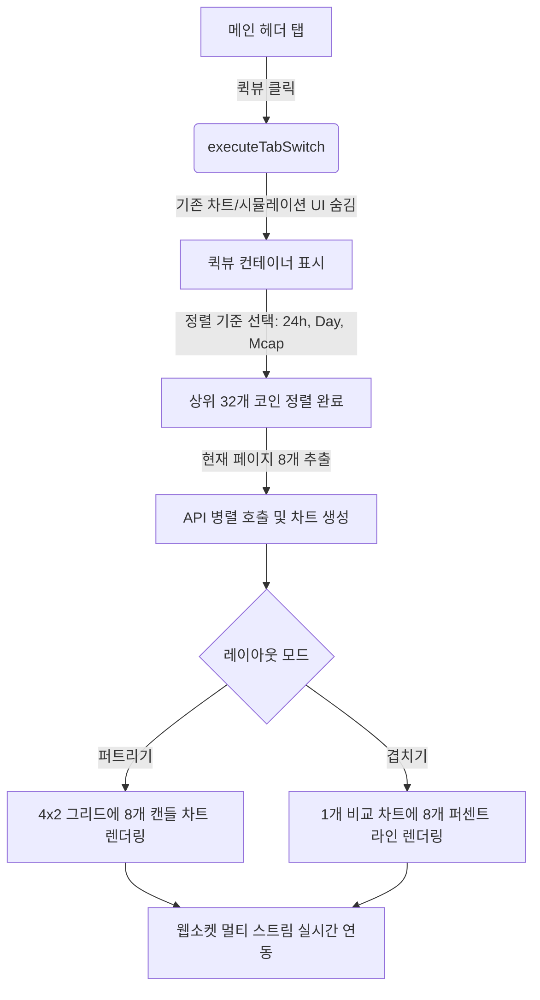

# 구현 계획서: 멀티플 차트 퀵뷰 (⚡ 퀵뷰)

이 계획서는 Sellnance 프로젝트의 **멀티플 차트 퀵뷰** (⚡ 퀵뷰) 기능 구현에 대한 설계 및 계획을 다룹니다. 이 기능은 상승률 및 시총 기준 상위 32개 자산 중 현재 페이지의 8개 자산을 4x2 그리드(퍼트리기)로 실시간 확인하거나, 하나의 차트(겹치기)에 합쳐서 비교 분석할 수 있게 하는 프리미엄 기능입니다.

---

## 사용자 검토 필요 사항

> [!IMPORTANT]
> **겹치기(Overlap) 모드의 가격 스케일 정규화**
> 비트코인(약 7만 달러)과 페페 코인(약 0.00001 달러)처럼 가격 격차가 큰 코인들을 하나의 차트에 그냥 겹쳐 그리면 축이 맞지 않아 비교가 불가능합니다.
> 따라서, 겹치기 모드에서는 **첫 번째 봉의 종가를 0%로 잡고 등락률(%) 변화로 변환하여 라인 차트**를 그립니다. 이렇게 하면 모든 코인이 동일 선상(0%)에서 출발하여 상승 및 하락 강도를 한눈에 비교할 수 있습니다.

> [!TIP]
> **웅장한 UI/UX 효과**
> 1. **초기 진입 화면**: 퀵뷰 탭을 누르면 먼저 화려한 Glassmorphic(유리 효과) 오버레이 화면이 나타나 정렬 기준(24시간 등락률, 오늘 등락률, 시가총액) 3가지 중 하나를 고르도록 유도합니다. 카드에 마우스를 올리면 튀어나오는 다이내믹 호버 애니메이션이 적용됩니다.
> 2. **퍼트리기 ↔ 겹치기 토글**: 토글 시 각 차트 카드가 자연스럽게 페이드아웃 되면서 겹치기용 단일 차트가 페이드인 되며, 우측 상단에 컬러풀한 자산명 범례(Legend)가 플로팅되어 가독성을 높입니다.

---

## 오픈 질문 (의사결정이 필요한 사항)

1. **타임프레임(TF) 동기화**:
   - 퀵뷰 차트의 타임프레임은 메인 터미널에서 선택 중인 글로벌 타임프레임(예: `1d`, `1h`, `15m` 등)을 그대로 따라가도록 설계하는 것을 권장합니다. 이에 대해 다른 의견이 있으신가요?
   *(글로벌 타임프레임과 연동되는 것이 다른 데이터 지표들과 정합성을 맞추기에 좋습니다.)*

2. **과거 데이터 조회 갯수 (Performance)**:
   - 8개 차트를 동시에 로드해야 하므로, API 요청 속도와 메모리 소모를 극대화하여 줄이기 위해 차트당 **과거 봉 데이터 100개**씩만 불러오고자 합니다. 퀵뷰 대시보드 용도로는 충분할까요?

---

## 제안된 변경 사항

⚡ 퀵뷰 전용 신규 자바스크립트 파일(`quickview.js`)을 생성하고, 기존 레이아웃 및 탭 스위칭 파일들을 연동하도록 구성합니다.

### 프론트엔드 작업 구성

#### [MODIFY] [index.html](file:///c:/Users/kmj/Sellnance/templates/index.html)
- 탭 버튼 영역(`#tab-btn-sim` 옆)에 `<button id="tab-btn-quickview">⚡ Quick View</button>` 추가.
- 우측 패널 본문에 `#quickview-container` 추가:
  - 제어 영역: 정렬 기준 버튼 3개, 레이아웃 토글 버튼 1개, 페이지네이션(◀ Page X / 4 ▶) 버튼.
  - 진입 화면 오버레이: Glassmorphism 스타일의 정렬 기준 선택 카드 3개 배치.
  - 본문 영역: 4x2 그리드 레이아웃 래퍼 및 겹치기 차트 전용 래퍼(Floating 범례 포함).

#### [MODIFY] [z_style.css](file:///c:/Users/kmj/Sellnance/static/z_style.css)
- 퀵뷰에 특화된 프리미엄 스타일 클래스 추가:
  - `.qv-grid`: 4x2 격자 배치를 위한 CSS Grid 구조.
  - `.qv-chart-card`: 은은한 테두리 글로우 효과 및 다크 테마 카드 디자인.
  - `.qv-init-card`: 진입 오버레이 전용 인터랙티브 카드 디자인 (scale & hover transition).
  - 겹치기 차트용 플로팅 레전드(범례) 라벨 스타일.

#### [MODIFY] [ui_control.js](file:///c:/Users/kmj/Sellnance/static/ui_control.js)
- `switchChartTab(mode)` 및 `executeTabSwitch(mode)` 수정:
  - `mode === 'quickview'` 일 때:
    - `tab-btn-quickview`를 활성화하고, 기존 차트/시뮬레이션 탭 비활성화.
    - 기존 단일 차트 헤더, 메인 차트, 호가창, 시뮬레이션 제어 바를 숨김.
    - 불필요한 트래픽 및 부하 방지를 위해 기존 메인 차트 웹소켓(`binanceChartWs`, `upbitChartWs`) 연결 해제.
    - 퀵뷰 컨테이너를 노출하고 `initQuickView()` 시동.
  - 퀵뷰에서 일반 차트나 시뮬레이터로 나갈 때:
    - 퀵뷰 전용 웹소켓 커넥션 전면 파괴.
    - 메모리 누수 방지를 위해 퀵뷰 차트 인스턴스 전면 파괴(destroy).
    - 메인 차트 웹소켓 복원 및 기존 차트 데이터 리로드(`fetchHistory()`).

#### [NEW] [quickview.js](file:///c:/Users/kmj/Sellnance/static/quickview.js)
새로운 정적 모듈을 생성하여 아래 기능을 구현합니다:
- **상태 관리**: 현재 정렬 기준(`24h`, `day`, `mcap`), 현재 페이지(1~4), 레이아웃 모드(`spread` ↔ `overlap`), 생성된 차트 인스턴스 배열, 실시간 웹소켓 인스턴스 저장.
- **탑 자산 필터링**: `store.originalTableData`에서 선택한 정렬 기준에 따라 상위 32개 코인을 정렬한 뒤, 현재 페이지의 8개 자산을 잘라내기(`activeSymbols`).
- **과거 데이터 로드**: `/api/candles` API를 8개 코인에 대해 `Promise.all`로 병렬 호출(limit=100)하여 캔들 데이터를 고속 수집.
- **차트 렌더링**:
  - **퍼트리기**: Lightweight Charts로 8개의 개별 캔들 차트를 4x2 그리드에 바인딩.
  - **겹치기**: 1개의 공통 차트를 생성하고, 8개 코인의 종가를 시작점 대비 변동률(%)로 변환하여 8개의 Line Series로 겹쳐 렌더링.
- **실시간 소켓 구독**:
  - 바이낸스 자산: 단일 웹소켓 연결로 복합 스트림 구독 (`stream?streams=ticker1@kline_1m/ticker2@kline_1m/...` 형식).
  - 업비트 자산: 단일 웹소켓 연결로 여러 KRW 코인 ticker 동시 구독.
  - 실시간 수신 메시지에 맞춰 퍼트리기 차트 및 겹치기 퍼센트 라인을 즉각 업데이트.

#### [MODIFY] [_main.js](file:///c:/Users/kmj/Sellnance/static/_main.js)
- `import "./quickview.js";`를 추가하여 모듈 등록.
- 전역 window 객체에 퀵뷰 제어용 이벤트 함수 바인딩 (`changeQuickViewSort`, `toggleQuickViewLayout`, `changeQuickViewPage`, `selectQuickViewInitSort` 등).

---

## 검증 계획

### 수동 검증 시나리오
1. **진입 검증**: ⚡ Quick View 탭 클릭 시 3개 카드 오버레이가 나타나는지 확인. "24H 등락률" 클릭 시 오버레이가 사라지고 8개 차트가 고속으로 로드되는지 검증.
2. **정렬 및 페이징**: 24h, Day, Mcap 버튼을 번갈아 누르며 정렬 결과가 맞는지 검증. 페이지 버튼(◀ ▶)을 누를 때 8개 자산이 딜레이 없이 갱신되는지 확인.
3. **토글 인터랙션**: "Spread (4x2)" 버튼을 눌러 "Overlap (겹치기)" 모드로 바꿀 때, 8개 코인이 하나의 차트에 등락률(%) 그래프로 오버랩되어 나타나는지 및 우측 상단에 범례가 제대로 표시되는지 확인. 다시 복원되는지 검증.
4. **실시간 업데이트**: 웹소켓 데이터가 실시간으로 수신되어 퀵뷰 차트의 마지막 봉과 겹치기 라인이 부드럽게 갱신되는지 확인.
5. **메모리/소켓 누수 방지**: 퀵뷰 탭에서 다른 탭으로 이동할 때 퀵뷰 웹소켓이 정상적으로 닫히고, 생성되었던 8개 차트의 Canvas 요소 및 메모리가 제거되는지 브라우저 개발자 도구(F12)로 모니터링.
