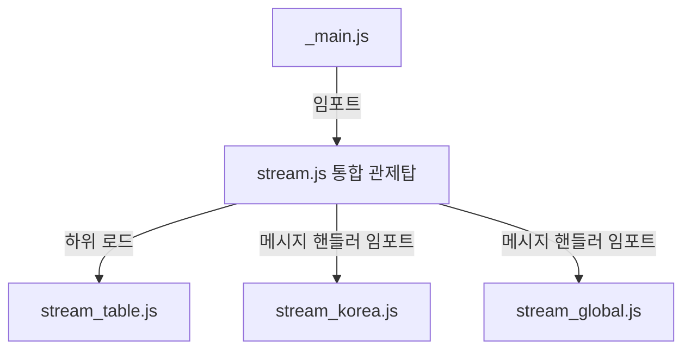

# 워크스루 - 소켓 로직 리팩토링 및 관제탑 모델 도입

모놀리식 구조의 웹소켓 스트림 엔진을 목적에 맞춰 분리하고, [stream.js](file:///c:/Users/kmj/Sellnance/static/stream.js)를 중심 **관제탑(Orchestrator)**으로 설정하는 구조적 리팩토링을 성공적으로 완료하였습니다.

## 아키텍처 구조

1. **[stream.js](file:///c:/Users/kmj/Sellnance/static/stream.js) (통합 관제탑)**:
   - 전체 실시간 데이터의 흐름을 관리하며 하위 분할 엔진들을 총괄합니다.
   - HTS 핵심 공통 렌더러인 `renderRealtimeRow` 및 공통 시간 유틸, 3초 배치 가격 업데이트 버퍼 루프(`radarIntervalId`)를 관리합니다.
   - **`startRealtimeCandle`** 핵심 관제 함수를 호스팅하며, 국내/해외 마켓 채널 연결 및 각 핸들러 바인딩을 주도적으로 제어합니다.
2. **[stream_table.js](file:///c:/Users/kmj/Sellnance/static/stream_table.js) (테이블 스트림)**:
   - 테이블 전체 시세 수집을 위한 마켓 레이더(Binance Spot/Futures, Upbit)와 정밀 타격용 스나이퍼 소켓을 구동하며, 화면 노출 영역 구독 리스트를 실시간으로 갱신합니다.
3. **[stream_korea.js](file:///c:/Users/kmj/Sellnance/static/stream_korea.js) (국내 거래소 스트림)**:
   - 국내 거래소(Upbit, Bithumb)의 실시간 체결 데이터를 수집하기 위한 팩토리 핸들러(`getUpbitMessageHandler`, `getBithumbMessageHandler`)와 실시간 김치 프리미엄 연산 로직을 담당합니다.
4. **[stream_global.js](file:///c:/Users/kmj/Sellnance/static/stream_global.js) (해외 거래소 스트림)**:
   - 해외 거래소(Binance, Bybit)의 실시간 체결 데이터를 수집하기 위한 팩토리 핸들러(`getBinanceMessageHandler`, `getBybitMessageHandler`)를 담당합니다.

## 변경 사항 및 작업 내용

### 소켓 엔진 최적화 분할 및 관제탑 구성

- 기존에 거대하고 비대했던 `streamEach.js` 소켓 파일을 완전히 제거했습니다.
- 기능별 코드를 `stream_table.js`, `stream_korea.js`, `stream_global.js`로 분배했습니다.
- `startRealtimeCandle` 관제 함수를 `stream.js`로 배치하고 각 마켓별 핸들러들을 가져와서 엮는 깔끔한 구조로 구성했습니다.
- `stream.js`를 통합 관제탑으로 개편하여 하위 파일들을 불러오게 하고 중복되던 함수 선언을 제거했습니다.
- [static/\_main.js](file:///c:/Users/kmj/Sellnance/static/_main.js)는 관제탑 파일인 `stream.js`만 임포트하도록 간소화했습니다.

## 검증 결과 및 확인 내용

- **모듈 빌드 테스트**: `npx vite build`를 통해 빌드 종속성 관계를 테스트하여 통합 관제탑 구조 하에 생성된 26개의 JavaScript 모듈이 단 한 건의 순환 참조나 구문 오류 없이 브라우저 환경 규격에 맞추어 정상 변환되는 것을 확인했습니다.
