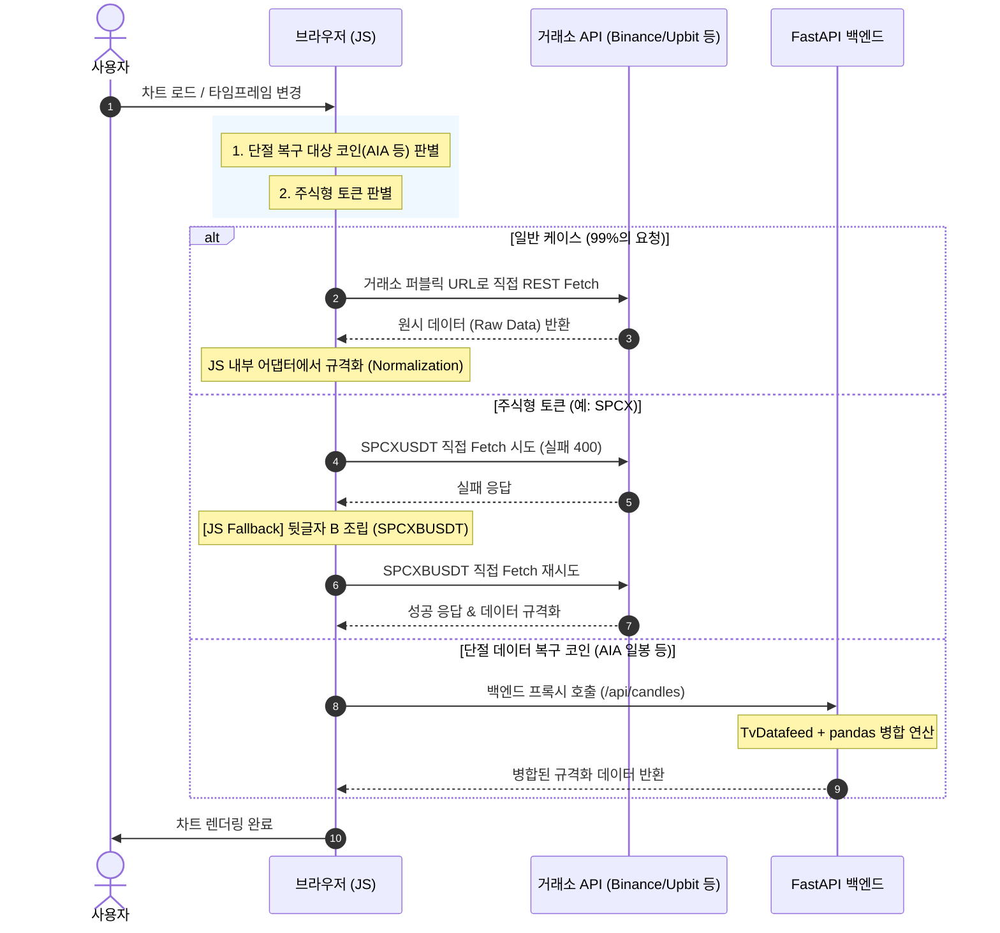

# 클라이언트 완결형 초고속 하이브리드 캔들 엔진 도입 계획 (JS 중심 리팩토링)

본 계획서는 기존 백엔드(FastAPI)에서 일괄 처리하던 **1) 거래소별 데이터 규격 통일(Normalization), 2) 에러 발생 시의 자동 재시도(Fallback/Retry), 3) 주식형 토큰 식별 및 티커 치환** 로직을 프론트엔드 JS 레벨로 대폭 이양하여 **대부분의 호출을 클라이언트-거래소 서버 간 직결 구조로 전환**하기 위한 계획입니다.

---

## 1. 아키텍처 개요 (클라이언트 중심 완결 구조)

대부분의 데이터 규격화 및 복원 작업이 브라우저에서 수행되며, 서버는 오직 브라우저에서 절대 수행 불가능한 `TvDatafeed` 조회용 프록시 역할만 수행합니다.

---

## 2. 레이어별 프론트엔드 이양 설계

### ① 거래소별 데이터 규격화 (Normalization in JS)
FastAPI의 `ExchangeAdapter`가 담당하던 거래소별 파싱 로직을 JS 내부 함수로 구현합니다.
* **Binance**: `[time, open, high, low, close, volume]` 형식의 2차원 배열을 파싱합니다.
* **Upbit**: `[opening_price, high_price, low_price, trade_price, ...]` 형태의 JSON 객체 배열을 파싱합니다.
* **Bybit**: `result.list` 내부의 문자열 데이터를 파싱합니다.
* **Bithumb**: `data` 배열 내부의 데이터를 파싱합니다.

### ② 주식형 토큰의 브라우저 단독 폴백 (Automatic Ticker Retry)
* 브라우저에서 `binance_spot`으로 `SPCXUSDT`를 직접 조회했을 때 400 에러(혹은 빈 데이터)가 발생하면, JS 내부의 에러 핸들러가 이를 감지하여 **자동으로 `SPCXBUSDT`로 재조회(`fetch`)를 1회 더 실행**합니다.
* 이 모든 과정이 브라우저와 바이낸스 간 통신으로만 이루어지며, 서버에는 1바이트의 트래픽도 유발하지 않습니다.

### ③ 백엔드 역할 최소화
* 백엔드는 오직 `TvDatafeed`와 같이 파이썬 전용 라이브러리가 필수적인 **특수 복구 모드**에 한해 호출을 수락하며, 그 외 모든 통신 통제권은 클라이언트가 가져갑니다.

---

## 3. 세부 파일별 수정 계획

### [MODIFY] [chart_data.js](file:///c:/Users/kmj/Sellnance/static/chart_data.js)
* **`fetchCandlesSmart(exchange, ticker, interval, limit, toVal)` 신설**:
  * 입력된 인자를 기반으로 거래소 퍼블릭 URL 직접 빌딩.
  * `fetch` 응답 상태 검사 (`response.ok`가 아닐 경우의 처리).
  * 바이낸스 현물(`binance_spot`) 에러 시 티커 끝에 `'B'`를 덧붙여(예: `SPCXBUSDT`) 1회 재시도하는 예외 복구 탑재.
  * 응답받은 원시 데이터를 거래소 규격에 따라 `{time, open, high, low, close, vol}` 형태의 통일된 객체 배열로 변환하여 반환.
  * 복구 대상(`AIA`) 일봉의 경우 서버 `/api/candles`로 바이패스 분기 처리.

---

## 4. 기대 효과

* **네트워크 레이턴시**: 기존 평균 200ms ~ 500ms ➔ **평균 50ms ~ 100ms** (0초 컷)
* **서버 호스팅 비용**: 99% 절감 (서버가 하는 일은 단순 9시 시가 캐싱 및 정적 페이지 호스팅이 전부이므로 무료 플랜으로 충분히 소화 가능)
* **안정성**: 동시 접속자가 10만 명이 되어도 각자의 IP로 거래소 API를 분산 호출하므로, 서버 IP 밴 우려가 영원히 소멸됨.
