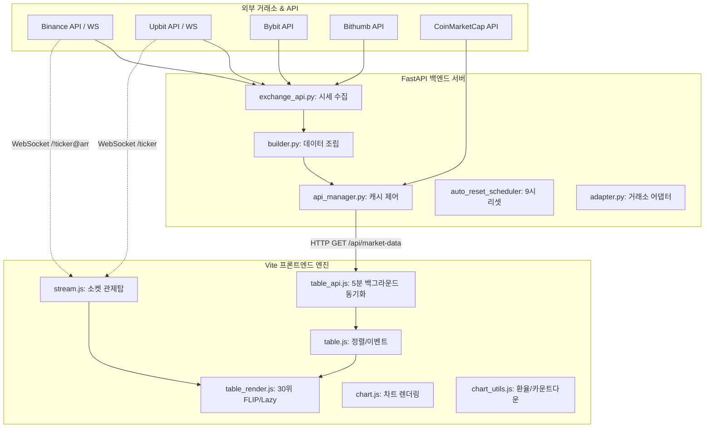

# 🚀 Sellnance - 전체 시스템 아키텍처 및 상세 설명서

본 문서는 **Sellnance(종합 암호화폐 터미널 & 시뮬레이터)**의 백엔드와 프론트엔드 전체 아키텍처, 핵심 제어 로직, 최적화 기법 및 테이블/차트 엔진의 운영 규칙을 총망라한 개발용 상세 설명서입니다.

---

## 📌 1. 시스템 개요 (System Overview)

Sellnance는 대용량 실시간 암호화폐 데이터(바이낸스, 업비트, 바이비트, 빗썸)를 수집하여 초고속으로 시각화하고, 과거 데이터를 기반으로 캔들 트레이딩 시뮬레이션을 제공하는 **HTS(Home Trading System)급 에지 최적화 터미널**입니다.

- **백엔드:** Python FastAPI 기반의 초고속 REST API 및 스케줄 캐싱 시스템
- **프론트엔드:** 순수 바닐라 자바스크립트(Vanilla JS)와 Lightweight Charts를 활용한 에지 최적화 렌더링

---

## ⚙️ 2. 시스템 아키텍처 (System Architecture)



---

## 🛡️ 3. 핵심 서브시스템 상세 규칙

### 1) HTS급 고속 테이블 엔진 (Table Engine)

테이블 엔진은 브라우저 성능 붕괴(Layout Thrashing)를 막기 위해 **상위 30개 동적 제어**와 **Lazy 렌더링** 구조로 이원화되어 작동합니다.

#### 🥇 상위 30개 규칙 (실시간 & 경주마 효과)

- **실시간 순위 변동 (FLIP):** 시세 및 등락률 변동에 따라 오직 **상위 30개** 행만 DOM을 물리적으로 재배치(`insertBefore`)하며, 팅김 없이 부드럽게 위치가 바뀌는 FLIP 애니메이션을 수행합니다.
- **실시간 웹소켓 정밀 구독:** 상위 30개 코인은 브라우저 가시성 및 활성 구독 리스트(`visibleSymbols`, `activeSubs`)에 즉각 등록되어 틱 단위 가격을 WebSocket으로 다이렉트 수신합니다.
- **즉시 렌더링:** 30위 내에 진입한 코인은 화면 밖에 숨겨
  - `table.js` - 테이블 정렬 엔진 실행 및 전역 이벤트 연동 바인더
  - `table_api.js` - HTTP 데이터 로드 및 5분 주기 Silent 백그라운드 동기화 엔진
  - `table_filter.js` - 탭 필터링(ALL/FAV) 및 거래소 AND/OR/ONLY 복합 다중 체크 필터
  - `table_render.js` - 상위 30개 FLIP 실시간 렌더링 및 IntersectionObserver 기반 하위 Lazy 렌더링
  - `table_sort.js` - 정렬 연산 알고리즘 및 250ms 실시간 정렬 쓰로틀링 제어
  - `ui_control.js` - 검색창 자동완성, 타임프레임 스위칭 등 공통 UI 인터랙션 관리
  - `z_style.css`, `z_style.min.css` - HTS 스타일 테마 CSS 및 레이아웃 스타일시트
- `templates/`
  - `index.html` - 메인 대시보드 뼈대 마크업 템플릿
- `public/`
  - `gemini-svg.svg` - 로고 벡터 그래픽 리소스

---

## 🚀 5. 실행 및 관리 방법 (Usage)
- **5분 주기 사일런트 업데이트:**
  - 5분마다 백엔드 캐시에서 최신 펀딩비와 시총 등의 정적 데이터를 가져오면, 기존 테이블의 줄바꿈(순서)은 흔들지 않고 **가시 화면 내의 수치 텍스트만 캐시를 우회하여 강제로 자연스럽게 갱신**합니다.

---

### 2) 웹소켓 관제탑 (WebSocket Orchestrator)

- **레이더 스트림(Market Radar):** 바이낸스(`!ticker@arr`) 및 업비트(`ticker`)의 모든 마켓 데이터를 백그라운드에서 상시 수신하여 `store.tickerBuffer`에 축적합니다.
- **3초 버퍼 플러시:** 3초 주기로 버퍼에 쌓인 실시간 틱 데이터를 `store.currentTableData` 전체에 안전하게 병합합니다.
- **정렬 쓰로틀링(250ms):** 초당 수백 번씩 쏟아지는 소켓 틱으로 인한 메인 스레드 마비를 막기 위해, 실시간 정렬 연산 주기는 최대 250ms로 쓰로틀링(Throttling) 제어합니다.

---

### 3) 차트 및 보간 엔진 (Chart & Interpolation)

- **법정 환율 기반 김치프리미엄:** 기존 Upbit USDT 대용 가격을 폐지하고, `FX_IDC`의 실제 `USD/KRW` 법정 환율을 연동해 실질적인 김프를 계산합니다.
- **주말 외환 휴장기 보간 (Forward Fill):** 주말 및 공휴일의 외환 시장 휴장 시, 인위적인 선형 보간 대신 **직전 영업일 금요일 종가 고시 환율을 주말 동안 그대로 유지**함으로써 차트 왜곡(일명 찌그러짐 현상)을 방지합니다.
- **차트 붕괴 방어막:** Lightweight Charts에 잘못된 시계열 데이터가 들어가면 전체 렌더링이 중단(Value is null 에러)되는 현상을 막기 위해, 시간 역행/NaN/중복 타임스탬프를 원천 제거하는 `sanitizeChartData` 데이터 정제 필터를 캔들 렌더링 최전선에 구축했습니다.

---

### 4) ⚡ 퀵뷰 엔진 (Quick View Engine - `quickview.js`)

주요 순위권 코인 8개의 차트를 한 화면에서 동시에 관제하고 비교 분석할 수 있는 특수 독립 패널입니다.

- **이중 레이아웃 모드 (Spread vs Overlap):**
  - **Spread (퍼트리기) 모드:** 8개 코인의 차트를 바둑판 형태로 나란히 배치해 독립적으로 관측합니다.
  - **Overlap (겹치기) 모드:** 8개 코인의 가격 흐름 선(Line)을 단 하나의 캔버스에 겹쳐서 렌더링함으로써 상관관계나 선도 흐름을 직관적으로 대조합니다. (자산별 고유 네온 컬러 부여 및 마우스 호버에 따른 동적 포커싱 기능 지원)
- **시간축 동기화 파이프라인 (TimeScale Sync):** 8개 중 하나의 차트에서 줌(Zoom) 또는 드래그(Scroll)로 시간 범위를 변경하면, 즉시 나머지 7개 차트의 가로 범위도 완전히 동일한 구간으로 일관성 있게 자동 동기화됩니다.
- **독립 소켓 파이프라인:** 메인 화면의 웹소켓 부하를 피하기 위해, 퀵뷰 전용 독자 멀티플렉스 스트림(`binanceWs` / `upbitWs`)을 구축해 선택된 8개 자산에 대한 `aggTrade`와 `kline` 정보만 선별 수신합니다.
- **자원 파괴 및 메모리 관리 (`destroyQuickView`):** 사용자가 퀵뷰 탭을 벗어나면 즉각 실시간 소켓 연결을 차단하고 8개 차트 인스턴스를 메모리에서 완전히 파괴(`remove()`)하여 브라우저 누수(Memory Leak)를 철저히 방지합니다.

---

## 📂 4. 디렉토리 구조 (Directory Structure)

- `run.py` - Uvicorn 구동 및 포트 강제 클리어 진입점
- `modules/`
  - `adapter.py` - 거래소별 통합 프록시 캔들 어댑터 (ExchangeAdapter)
  - `api_manager.py` - 백엔드 데이터 캐싱, 수집 관제 및 9시 시가 캡처 스케줄러
  - `app.py` - FastAPI 웹 앱 진입점 및 환경 설정, 캔들 캐싱 API 라우팅
  - `builder.py` - 거래소별 데이터와 CMC 시총 정보를 합산하여 대시보드 최종 조립
  - `builder_binance.py`, `builder_bybit.py`, `builder_upbit.py` - 거래소별 지표 조립 세부 부대
  - `cmc_api.py` - CoinMarketCap API 연동 및 크레딧 방어 캐싱
  - `config_manager.py` - `mapping.json` 족보 데이터 로드 및 저장 관리
  - `exchange_api.py` - 바이낸스, 업비트, 바이비트, 빗썸 시세 및 펀딩비 수집 코어
  - `trace_hooking.py` - 백엔드 초기화 시 데이터 수집 진행 상황 트래킹 훅
  - `utils.py` - 가상자산 심볼 파싱 및 순수 자산명 변환 유틸리티
  - `main.go`, `cache.go`, `fetcher.go` - 초고속 수집기 백엔드 Go 포팅 모듈
- `static/`
  - `_store.js` - 프론트엔드 전역 상태 및 옵션 설정 단일 관리 (Single Source of Truth)
  - `_main.js` - 화면 초기 로드, 방향키 감지, 브라우저 탭 활성화 복구 관리
  - `api.js`, `app_loader.js` - 초기 리소스 로더 모듈
  - `chart.js` - 차트 엔진 초기화 및 테마 전환 코어
  - `chart_api.js` - 차트 심볼 로드 API
  - `chart_data.js` - 차트 히스토리 조회 및 2중 데이터 클렌징(sanitizeChartData) 방어막
  - `chart_data_kimchi.js` - 김치프리미엄 지표 차트 전용 데이터 처리기
  - `chart_draw.js` - 추세선, 수평선, 피보나치 등 트레이딩 뷰 스타일 그리기 도구 엔진
  - `chart_layout.js` - 메인/볼륨/김프 차트 간 화면 분할 비율 제어 및 리사이저
  - `chart_measure.js` - 차트 내 Shift+클릭 자(Measure) 측정 도구 엔진
  - `chart_utils.js` - 실시간 카운트다운 오버레이 및 가격/거래량 포맷팅 헬퍼
  - `lwc_error_tracker.js` - Lightweight Charts 비동기 렌더링/크래시 전방위 감시 인터셉터
  - `orderbook.js` - 호가창(Orderbook) 렌더링 및 누적 매수/매도 잔량 비주얼라이저
  - `quickview.js` - 8분할/겹치기 레이아웃 퀵뷰 멀티 차트 제어 및 독립 소켓 파이프라인
  - `sim_engine.js` - 시뮬레이터 차트 및 조건식 캔들 백테스트 미리보기 엔진
  - `start.js` - 시작 뷰 컨트롤러
  - `stream.js` - 실시간 웹소켓 통합 관제탑 및 3초 버퍼 병합 엔진
  - `stream_global.js`, `stream_korea.js` - 글로벌/국내 웹소켓 실시간 이벤트 수신기
  - `stream_table.js` - visibleSymbols 기반 테이블 스나이퍼 실시간 소켓 동기화
  - `table.js` - 테이블 정렬 엔진 실행 및 전역 이벤트 연동 바인더
### 1) 엔진 구동

터미널에서 아래 명령어로 백엔드 서버와 프론트엔드를 실행합니다.

```bash
python run.py
```

- 서버는 기본적으로 `http://127.0.0.1:8000` 포트에서 실행되며, 실행 시 포트를 점유 중인 기존 프로세스를 클리어하고 자동으로 기본 브라우저를 띄웁니다.

### 2) 9시 정시 리셋 스케줄러

백엔드(`api_manager.py` 및 `app.py`) 내부적으로 매일 한국 시간(KST) 오전 9시 정각이 되면 시가 데이터를 캡처하고 프론트엔드와 캐시 데이터를 자동으로 동기화합니다.


---

## 🚀 5. 실행 및 관리 방법 (Usage)

### 1) 엔진 구동

터미널에서 아래 명령어로 백엔드 서버와 프론트엔드를 실행합니다.

```bash
python run.py
```

- 서버는 기본적으로 `http://127.0.0.1:8000` 포트에서 실행되며, 실행 시 포트를 점유 중인 기존 프로세스를 클리어하고 자동으로 기본 브라우저를 띄웁니다.

### 2) 9시 정시 리셋 스케줄러

백엔드(`api_manager.py` 및 `app.py`) 내부적으로 매일 한국 시간(KST) 오전 9시 정각이 되면 시가 데이터를 캡처하고 프론트엔드와 캐시 데이터를 자동으로 동기화합니다.
