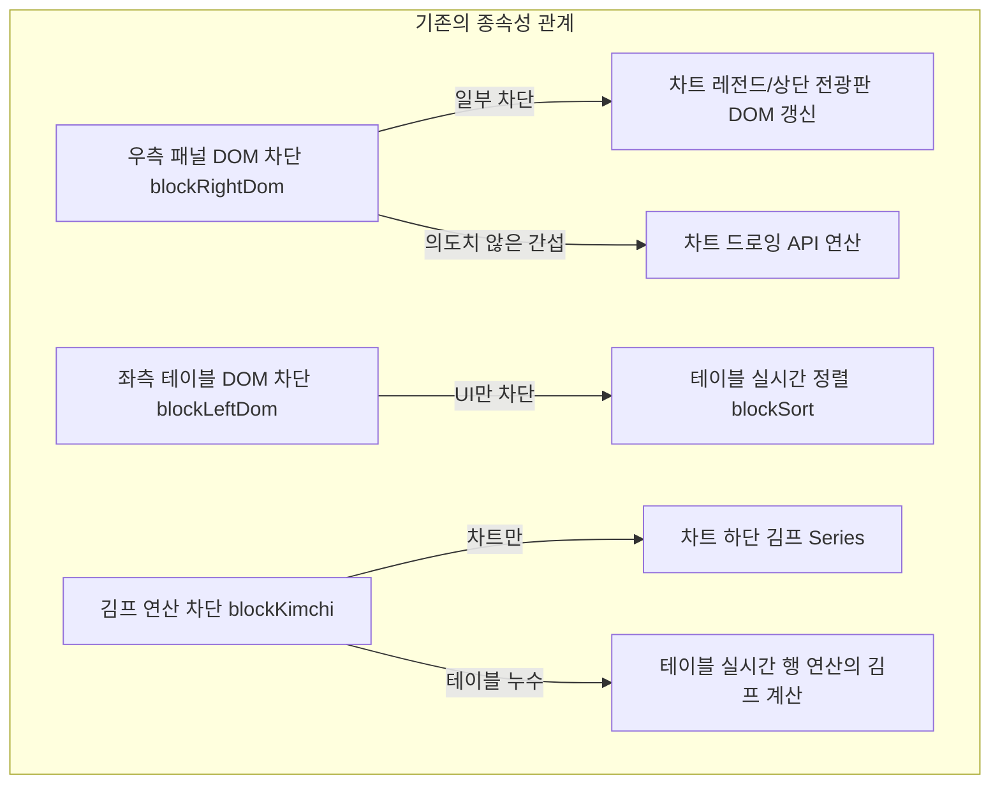

# 성능 디버거 렉 유발 요인의 독립성 분석 및 정밀 격리 제어 계획

이 보고서는 Sellnance 대시보드 내 실시간 성능 디버그 도구의 각 차단 기능들이 서로 간섭받지 않고 완전히 독립적인 스위치로 작동하도록 정밀 분기 및 격리 구조를 검토하고 개선안을 제시합니다.

---

## 1. 현재 구현의 종속성(포함관계) 분석 및 한계

현재 성능 디버거는 다음과 같은 중복 제어 및 종속성 문제를 포함하고 있어, 어떤 요인이 실제 프레임 드랍을 유발하는지 정밀하게 격리하기 어렵습니다.



### 🚨 문제 사례 1: 우측 패널 DOM 차단 vs 차트 실시간 갱신 차단
* **현상**: `blockRightDom`은 우측 영역의 돔 갱신(레전드 텍스트 변경 등)만 제어해야 하지만, 차트 렌더링 라이브러리 스크립트가 우측 패널 전체의 하위 요소로 간주되어 함께 멈추거나, `blockRightDom`이 켜진 상태에서 차트 내부 옵션 리사이징(`applyChartLayout`) 등이 차트 스레드 내부와 오버랩될 여지가 있습니다.
* **영향**: 차트의 내부 캔버스 연산 부하와 순수 DOM 조작(Reflow) 부하를 독립적으로 분리하여 측정할 수 없습니다.

### 🚨 문제 사례 2: 좌측 테이블 DOM 차단 vs 테이블 실시간 정렬 차단
* **현상**: `blockLeftDom`은 테이블 안의 텍스트(가격, 거래량 등)를 교체하고 CSS Flash 효과를 부여하는 행위를 제어합니다. 하지만 `blockLeftDom`이 활성화되어 화면이 고정되어 있음에도 불구하고, 백그라운드에서는 웹소켓이 올 때마다 `applyRealtimeSort` 정렬 함수가 호출되어 전체 메모리 배열을 정렬하고 리사이징을 내부적으로 계산할 수 있습니다.
* **영향**: 정렬 알고리즘 연산량 부하(CPU)와 DOM 셀 재배치/페인팅 부하(GPU)가 격리되지 않습니다.

### 🚨 문제 사례 3: 실시간 김프 연산 차단 누수
* **현상**: `blockKimchi` 작동 시 차트 하단의 `kimchiSeries` 갱신은 확실히 막히나, 좌측 테이블의 각 행(`renderRealtimeRow`) 내부에서는 여전히 `store.marketDataMap.krw_usd_rate`를 참조하여 환산 가격 및 김프 차이 연산이 매번 돌고 있을 수 있습니다.

---

## 2. 정밀 분기 및 격리 설계 (독립성 확보)

각 토글이 **단 하나의 고유한 연산/갱신 범위**만 통제하도록 역할을 100% 독립시킵니다.

| 디버그 토글 | 제어 타겟 변수 | 실질적 통제 범위 (독립적인 작동 방식) |
| :--- | :--- | :--- |
| **우측 패널 DOM 차단** | `store.blockRightDom` | 차트 상단 헤더, OHLC 레전드 텍스트 변경 및 클래스 변경 DOM API 차단 (차트 캔버스 드로잉은 영향 없음) |
| **차트 실시간 갱신 차단** | `store.blockChartDom` | `candleSeries.update` 및 `volumeSeries.update` 등 Lightweight Charts 라이브러리 엔진의 렌더링 API 호출만 차단 |
| **좌측 테이블 DOM 차단** | `store.blockLeftDom` | 테이블 행의 가격/거래량 `innerText` 변경, 등락율 텍스트 변경, Flash 플래싱 애니메이션 CSS 주입만 차단 |
| **테이블 실시간 정렬 차단** | `store.blockSort` | 웹소켓 유입 시 주기적으로 메모리 상의 배열을 정렬하고 행을 DOM 상에서 재배치하는 `applyRealtimeSort` 실행만 차단 |
| **실시간 김프 연산 차단** | `store.blockKimchi` | 차트의 김프 피드백(`updateRealtimeKimchi`) 계산 및 실시간 소켓 업데이트 내에서의 김프 산출 수학 공식 연산 완전 스킵 |

---

## 3. 코드 개선 구체안

### A. [MODIFY] [stream_render.js](file:///c:/Users/kmj/Sellnance/static/stream_render.js)
차트 실시간 갱신 차단(`blockChartDom`) 시에만 차트 드로잉 API가 중단되도록 완전히 격리합니다.
```javascript
export function renderRealtimeUpdate(normalizedTime, currentCandle) {
    // 오직 blockChartDom 플래그에 의해서만 통제됨
    if (store.blockChartDom) return;
    if (!store.candleSeries || !currentCandle || normalizedTime === null) return;
    ...
}
```

### B. [MODIFY] [table_sort.js](file:///c:/Users/kmj/Sellnance/static/table_sort.js)
실시간 정렬 차단(`blockSort`) 시 가격 변동에 따른 테이블 행 재배열 로직만 단독 제어합니다.
```javascript
export function applyRealtimeSort() {
  if (store.blockSort) return; // 정렬 차단 시 즉시 리턴
  if (!store.currentSortCol || store.sortState === "") return;
  ...
}
```

### C. [MODIFY] [stream_korea.js](file:///c:/Users/kmj/Sellnance/static/stream_korea.js)
김프 연산 차단(`blockKimchi`) 시 차트 김프 시리즈와 연산 로직을 스킵합니다.
```javascript
export function updateRealtimeKimchi(liveData, symbol, chartTime) {
  if (store.blockKimchi) return; // 김프 차단 시 즉시 리턴
  ...
}
```

### D. [MODIFY] [stream.js](file:///c:/Users/kmj/Sellnance/static/stream.js)
실시간 가격 수신(`renderRealtimeRow`)부 내부에서 김프 계산 및 좌측 테이블 DOM 갱신을 개별 플래그에 맞춰 완벽하게 분기 처리합니다.
```javascript
// 김프 연산 차단 시 김프 계산 스킵
if (!store.blockKimchi) {
  // 김치프리미엄 계산 및 row.Kimchi_Raw 필드 주입 수행
}

// 좌측 테이블 DOM 차단 시 갱신 스킵
if (store.blockLeftDom) return;
// 실제 DOM 조작 및 Flash 애니메이션 수행
```

---

## 4. 검증 계획

1. **빌드 안정성 확인**: 수정 후 `npx vite build`를 통해 빌드가 깨지는 부분이 없는지 검증합니다.
2. **개별 토글 성능 프로파일링**: 
   * 브라우저 개발자 도구의 Performance 탭에서 녹화를 진행하며 하나의 토글씩 교대로 활성화하여 CPU/GPU 병목 지점이 사라지는지 그래프 상으로 격리 확인을 수행합니다.
